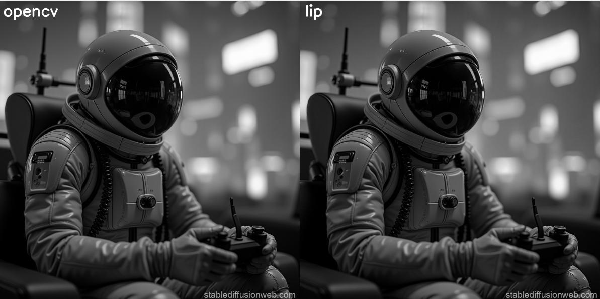

### **Técnica del Proceso de Conversión a Escala de Grises**

#### **1. Introducción**
La conversión de una imagen en color a escala de grises es un proceso fundamental en el procesamiento de imágenes. Este proceso reduce la dimensionalidad de los datos de la imagen, pasando de tres canales de color (rojo, verde y azul) a un solo canal de intensidad. Esto simplifica el análisis y reduce el costo computacional en aplicaciones posteriores, como detección de bordes, segmentación o reconocimiento de patrones.

En este articulo, se describe el proceso de conversión a escala de grises de una imagen.
1. **Método de OpenCV**: Utiliza la función `cv.cvtColor` con el parámetro `cv.COLOR_BGR2GRAY`.
2. **Método Personalizado**: Implementa la fórmula de luminosidad manualmente en la función `BgrToGray`.

```python
def BgrToGray(img):

    img = img.astype(np.float32)

    blue, green, red = cv.split(img)
    
    gray_img = 0.299 * red + 0.587 * green + 0.114 * blue
    
    gray_img = np.clip(gray_img, 0, 255)

    return gray_img.astype(np.uint8)   
```
3. **Programa de referencia**: `gray_sacle.py`.

---

#### **2. Fundamentos Matemáticos**

##### **2.1. Espacio de Color BGR**
Una imagen en color en OpenCV se representa en el espacio de color **BGR** (Blue, Green, Red). Cada píxel tiene tres componentes:
- \( B(x, y) \): Intensidad del canal azul.
- \( G(x, y) \): Intensidad del canal verde.
- \( R(x, y) \): Intensidad del canal rojo.

Cada componente tiene un valor en el rango \([0, 255]\) para imágenes de 8 bits.

##### **2.2. Fórmula de Luminosidad**
La conversión a escala de grises se basa en la percepción humana del brillo. El ojo humano es más sensible al verde que al rojo y al azul. Por lo tanto, se utiliza una combinación lineal ponderada de los canales BGR para calcular la intensidad de gris:

\[
I_{\text{gris}}(x, y) = 0.299 \cdot R(x, y) + 0.587 \cdot G(x, y) + 0.114 \cdot B(x, y)
\]

Donde:
- \( I_{\text{gris}}(x, y) \): Intensidad de gris en la posición \((x, y)\).
- Los coeficientes \( 0.299 \), \( 0.587 \), y \( 0.114 \) son pesos estándar definidos por el estándar **ITU-R BT.601**.

---

#### **3. Implementación del Método Personalizado**

##### **3.1. Conversión a Tipo `float32`**
```python
img = img.astype(np.float32)
```
- **Propósito**: Convertir la imagen a tipo `float32` para evitar desbordamientos o pérdida de precisión durante los cálculos.
- **Justificación**: Las operaciones aritméticas con números de punto flotante son más precisas que con enteros, especialmente cuando se multiplican valores grandes.

##### **3.2. Separación de Canales**
```python
blue, green, red = cv.split(img)
```
- **Propósito**: Dividir la imagen en sus tres canales de color (B, G, R).
- **Resultado**: Se obtienen tres matrices 2D, cada una representando un canal de color.

##### **3.3. Aplicación de la Fórmula de Luminosidad**
```python
gray_img = 0.299 * red + 0.587 * green + 0.114 * blue
```
- **Propósito**: Calcular la intensidad de gris para cada píxel utilizando la fórmula de luminosidad.
- **Operaciones**:
  - Multiplicación de matrices por escalares (coeficientes de luminosidad).
  - Suma de matrices para combinar los canales.

##### **3.4. Recorte de Valores**
```python
gray_img = np.clip(gray_img, 0, 255)
```
- **Propósito**: Asegurar que los valores de la imagen estén en el rango \([0, 255]\).
- **Justificación**: Durante los cálculos, algunos píxeles pueden tener valores fuera de este rango (por ejemplo, negativos o mayores a 255). El recorte garantiza que la imagen resultante sea válida.

##### **3.5. Conversión a Tipo `uint8`**
```python
return gray_img.astype(np.uint8)
```
- **Propósito**: Convertir la imagen de vuelta a tipo `uint8` (8 bits sin signo).
- **Justificación**: Las imágenes en OpenCV suelen almacenarse en formato `uint8`, que es compatible con la mayoría de las funciones de procesamiento de imágenes.

---

#### **4. Implementación del Método de OpenCV**

##### **4.1. Uso de `cv.cvtColor`**
```python
img2_cv = cv.cvtColor(img1, cv.COLOR_BGR2GRAY)
```
- **Propósito**: Convertir la imagen BGR a escala de grises utilizando la función integrada de OpenCV.
- **Internamente**: OpenCV aplica la misma fórmula de luminosidad, pero optimizada para rendimiento.

---

#### **5. Comparación de Resultados**

##### **5.1. Visualización**
```python
lip.show_images_together([img2_cv, img2_lip], ["opencv", "lip"])
```   
- **Propósito**: Mostrar las imágenes en escala de grises generadas por ambos métodos en una sola ventana para compararlas.
- **Resultado Esperado**: Ambas imágenes deben ser visualmente idénticas, ya que utilizan la misma fórmula de luminosidad.

<div align="center">

  
</div>
