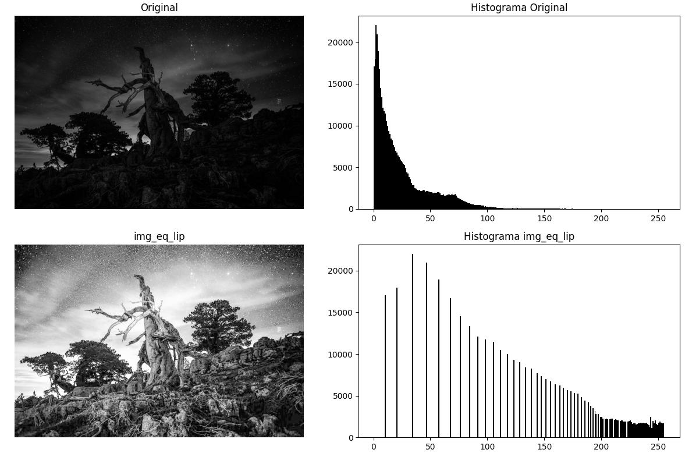
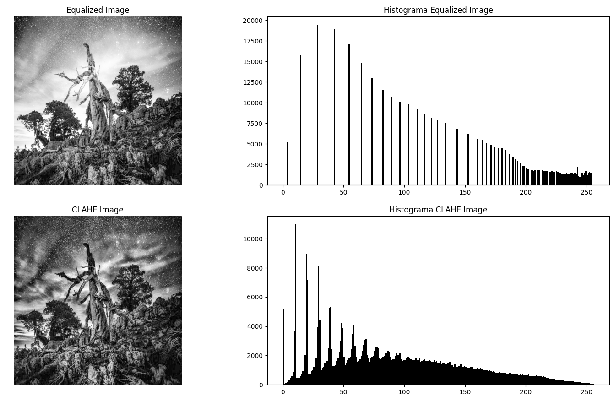

### **Proceso de Ecualización del Histograma**  

1. **Calcular el histograma**: Se obtiene la frecuencia de aparición de cada nivel de gris en la imagen.  
2. **Calcular la función de distribución acumulativa (CDF)**: Se suma progresivamente la frecuencia de cada nivel de gris.  
3. **Normalizar la CDF**: Se escala la CDF dividiéndola por el número total de píxeles.  
4. **Reasignar valores de intensidad**: Se usa la CDF normalizada para transformar los valores originales de los píxeles.  
5. **Generar la nueva imagen**: Se reemplazan los valores de la imagen original con los nuevos valores obtenidos de la transformación.  

---

### **Ejemplo de Implementación en Python**  

A continuación, se muestra una implementación en Python de la ecualización del histograma utilizando NumPy:  

```python

def HistogramEqualization(img):
    """
    Apply histogram equalization to an input image.
    
    Parameters:
        img (numpy.ndarray): Input grayscale image as a 2D numpy array.
    
    Returns:
        numpy.ndarray: Image after applying histogram equalization.
    """
    # Compute the histogram
    hist, bins = np.histogram(img.flatten(), bins=256, range=[0, 256])

    # Compute the cumulative distribution function (CDF)
    cdf = hist.cumsum()

    cdf_normalized = cdf / cdf[-1]  # Normalize CDF to range from 0 to 1

    # Map original values to new values using the CDF
    cdf_scaled = (cdf_normalized * 255).astype(np.uint8)  # Scale to [0, 255]

    img_equalized = cdf_scaled[img]  # Apply transformation using lookup table

    return img_equalized
```

---

### **Ejemplo Visual**  

La imagen ecualizada tiene un **mejor contraste**, permitiendo distinguir más detalles en regiones oscuras y brillantes.  

<div align="center">

  
</div>

<div align="center">
  Programa de referencia : `histogram_equa.py`. 
</div>

### **Limitaciones**  
- Puede **exagerar el ruido** en imágenes con variaciones pequeñas de intensidad.  
- No siempre proporciona la mejora visual deseada si la imagen ya tiene un buen contraste.  
- No considera la **distribución espacial** de los píxeles, lo que puede generar efectos no naturales en algunas imágenes.  

Para solucionar estos problemas, se pueden usar variantes como la **ecualización adaptativa del histograma (CLAHE)**, que aplica la técnica en regiones más pequeñas de la imagen.

---

# CLAHE (Contrast Limited Adaptive Histogram Equalization)

**CLAHE** (Contrast Limited Adaptive Histogram Equalization) es un algoritmo de procesamiento de imágenes utilizado para mejorar el contraste local de una imagen, especialmente en aquellas que presentan áreas oscuras o brillantes. A diferencia de la ecualización de histograma global (HE), que aplica una única transformación de contraste a toda la imagen, CLAHE realiza la ecualización de forma local en bloques pequeños de la imagen. Esto permite mantener detalles en las áreas de bajo contraste sin amplificar el ruido en las zonas uniformes.

### ¿Cómo funciona CLAHE?

CLAHE mejora el contraste de la imagen adaptativamente utilizando los siguientes pasos:

1. **División de la imagen en bloques**: La imagen se divide en bloques de tamaño uniforme. La cantidad de bloques está determinada por el parámetro `grid_size`, que define el número de filas y columnas en las que se divide la imagen.

2. **Cálculo del histograma de cada bloque**: Para cada bloque de la imagen, se calcula el histograma de intensidades de píxeles. Este histograma describe la distribución de las intensidades en ese bloque específico.

3. **Recorte del histograma**: El histograma de cada bloque se recorta si alguna de sus "barras" excede un umbral máximo especificado por el parámetro `clip_limit`. Este paso previene la sobreamplificación de los valores de intensidad, que podría generar ruido en áreas uniformes. El exceso de valores recortados se redistribuye uniformemente entre todos los bins del histograma.

4. **Ecualización de histograma local**: Después de recortar el histograma, se aplica la ecualización de histograma a cada bloque, utilizando una función de distribución acumulada (CDF) para mapear las intensidades de los píxeles a un rango de valores uniformemente distribuidos.

5. **Interpolación bilineal entre bloques**: Para evitar bordes visibles entre bloques al recomponer la imagen, se aplica una interpolación bilineal entre los bloques. Esto suaviza las transiciones entre diferentes regiones y asegura una salida visualmente continua.

6. **Combinación de bloques**: Finalmente, después de la ecualización de los bloques individuales y la interpolación, se combinan los bloques ecualizados para formar la imagen final con el contraste mejorado.

### Ventajas de CLAHE

- **Contraste adaptativo**: CLAHE mejora el contraste local de la imagen, lo que es especialmente útil en imágenes con áreas de iluminación desigual.
- **Control sobre el recorte de histograma**: El parámetro `clip_limit` permite limitar la amplificación de ruido, controlando el nivel de contraste que se aplica.
- **Preservación de detalles**: Gracias a la ecualización local y la interpolación entre bloques, el algoritmo ayuda a preservar los detalles en las áreas oscuras o brillantes de la imagen, evitando la sobresaturación.

### Parámetros del algoritmo

- **`imagen`**: Arreglo numpy de tipo `uint8` que contiene la imagen original en escala de grises. La forma de la imagen debe ser `(alto, ancho)`.
- **`clip_limit`**: Un valor entero que especifica el límite máximo para el recorte del histograma de cada bloque. Un valor típico podría ser 10, pero depende de las características de la imagen.
- **`grid_size`**: Una tupla `(n_rows, n_cols)` que define cuántos bloques tendrá la imagen. Este parámetro determina la resolución de la ecualización local. Un valor común es `(8, 8)`.

### Ejemplo de uso

"Con la implementación de CLAHE, se conservan los detalles de las estrellas y las nubes, a diferencia de la ecualización del histograma, donde se produce una sobresaturación que provoca la pérdida de detalles." 

<div align="center">

  
</div>

<div align="center">
  Programa de referencia : `histogram_equa_clahe.py`. 
</div>

### Conclusión

CLAHE es una técnica potente para el procesamiento de imágenes, especialmente cuando se necesita mejorar el contraste en áreas locales sin afectar negativamente a otras zonas de la imagen. Gracias a su capacidad para adaptarse a diferentes regiones de la imagen y a su control sobre la amplificación del ruido, CLAHE se utiliza en una amplia variedad de aplicaciones que requieren una mejora detallada del contraste.

--- 
