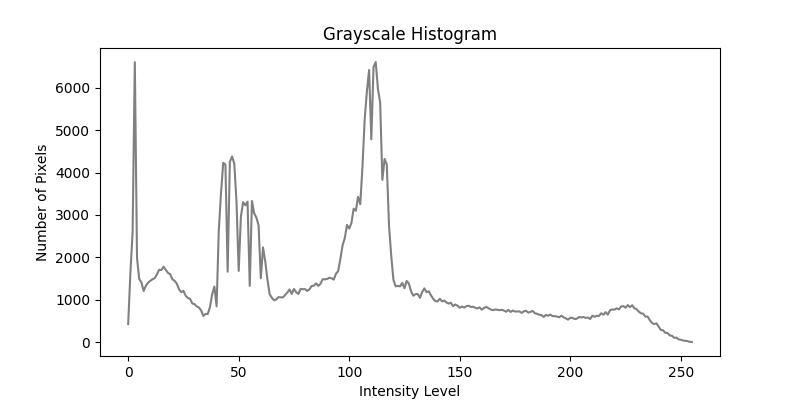
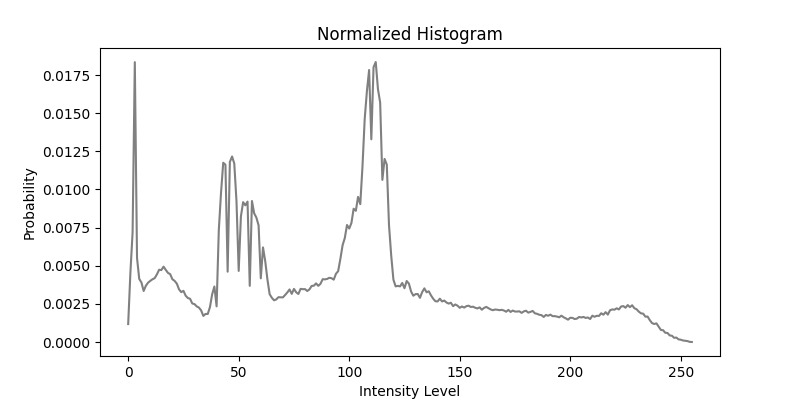
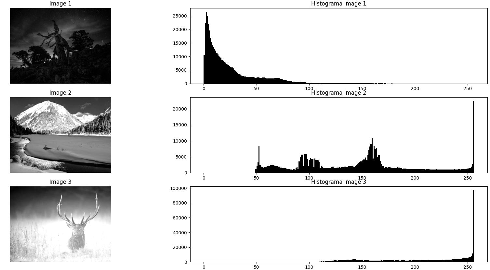

### Histograma en Escala de Grises  

Un **histograma** es una técnica sencilla pero poderosa para analizar las estadísticas de cualquier tipo de datos. Consiste en dividir el espacio donde residen los datos en **bins** (intervalos) y registrar la cantidad de ocurrencias en cada uno.  

En el caso de las imágenes en **escala de grises**, el histograma representa la distribución de niveles de intensidad de la imagen. Los niveles de gris en una imagen digital están definidos en un conjunto discreto de valores que van de **0 a 255**, donde:  
- **0** representa el negro absoluto.  
- **255** representa el blanco absoluto.  
- Los valores intermedios corresponden a distintos tonos de gris.  

El **histograma de niveles de gris** es un **arreglo unidimensional** de 256 posiciones, donde cada posición almacena la cantidad de píxeles que tienen un determinado nivel de gris. Formalmente, si \( n_i \) representa el número de píxeles con nivel de gris \( i \), el histograma \( h(i) \) se define como:  

\[
h(i) = n_i, \quad i \in [0, 255]
\]

Este histograma actúa como un **resumen de la imagen**, ya que captura **qué niveles de gris están presentes**, pero **no dónde aparecen** en la imagen. En otras palabras, **toda la información espacial se pierde**.  

#### Cálculo del Histograma  
El cálculo del histograma es un proceso directo:  
1. Se inicializa un arreglo de 256 posiciones en **cero**.  
2. Se recorren todos los píxeles de la imagen.  
3. Por cada nivel de gris encontrado, se incrementa el valor correspondiente en el arreglo.  

Al finalizar este proceso, cada posición en el arreglo contiene la cantidad de píxeles que presentan ese nivel de gris específico.  

<div align="center">

  
</div>


#### Histograma Normalizado  
Para obtener el **histograma normalizado**, cada valor del histograma se divide entre el número total de píxeles en la imagen:  

\[
h_n(i) = \frac{h(i)}{N}
\]

donde \( N = \text{ancho} \times \text{alto} \) es el número total de píxeles.  

<div align="center">

  
</div>


El histograma normalizado representa la **función de densidad de probabilidad (PDF)** de los niveles de gris en la imagen. Es decir, cada valor \( h_n(i) \) indica la probabilidad de que un píxel seleccionado al azar tenga el nivel de gris \( i \).  

\[
\sum_{i=0}^{255} h_n(i) = 1
\]

A diferencia del histograma original, cuyos valores son enteros, el histograma normalizado contiene valores en punto flotante.

### Interpretación de Histogramas  

Los histogramas de niveles de gris permiten visualizar fácilmente las propiedades estadísticas de una imagen. Analizando la distribución de los valores en el histograma, es posible obtener información sobre la **luminosidad** y el **contraste** de la imagen.  

#### Luminosidad de la Imagen  
- **Imagen oscura:** Si la imagen es demasiado oscura, la mayoría de los valores del histograma estarán concentrados en los niveles de gris bajos (cercanos a 0). Esto significa que la imagen tiene muchos píxeles negros o de tonos muy oscuros.  
- **Imagen brillante:** Si la imagen es demasiado brillante, los valores del histograma estarán concentrados en los niveles de gris altos (cercanos a 255), lo que indica que predominan los píxeles blancos o de tonos claros.  
- **Imagen sobreexpuesta:** Cuando una imagen está sobreexpuesta, una gran cantidad de píxeles alcanzan el valor máximo de intensidad (255), lo que se refleja como un **pico pronunciado en el histograma en \( h(255) \)**.  


<div align="center">

  
</div>

<div align="center">
  Programa de referencia : `hist_graysacle.py`. 
</div>


#### Contraste de la Imagen  
- **Imagen de bajo contraste:** Si los valores del histograma están concentrados en un rango estrecho de niveles de gris, significa que la imagen tiene **poco contraste**. En este caso, la imagen puede parecer apagada o sin detalles bien diferenciados.  
- **Imagen de alto contraste:** Cuando los valores del histograma están bien distribuidos a lo largo de todo el rango (0-255), la imagen tiene **alto contraste**, lo que significa que hay una clara diferencia entre áreas oscuras y claras.  

El análisis del histograma es fundamental en muchas aplicaciones de procesamiento de imágenes, ya que permite diagnosticar problemas de iluminación y calidad de imagen, además de ser la base para técnicas de mejora como la **ecualización del histograma**.

### **Ecualización del Histograma**  

La **ecualización del histograma** es una técnica de procesamiento de imágenes utilizada para mejorar el **contraste** de una imagen en escala de grises. Esta técnica redistribuye los niveles de gris de manera que la imagen resultante tenga una distribución de intensidad más uniforme, lo que permite resaltar detalles y mejorar la percepción visual.  


### **Concepto**  

El objetivo de la ecualización del histograma es transformar la imagen original \( I(x, y) \) en una imagen mejorada \( I'(x, y) \), donde los niveles de gris estén distribuidos de manera más homogénea.  

Dado el histograma original de la imagen, se calcula la **función de distribución acumulativa (CDF, por sus siglas en inglés)** y se usa para reasignar los valores de los píxeles de la imagen. La transformación está definida por:  

\[
I'(x, y) = \frac{\text{CDF}(I(x, y))}{\text{N}} \times (L - 1)
\]

donde:  
- \( I(x, y) \) es la imagen original.  
- \( I'(x, y) \) es la imagen resultante después de la ecualización.  
- \( \text{CDF}(i) \) es la función de distribución acumulativa para el nivel de gris \( i \).  
- \( N \) es el número total de píxeles en la imagen.  
- \( L \) es el número de niveles de gris (normalmente 256).  

Este procedimiento **expande el rango dinámico** de los niveles de gris y mejora la visibilidad de detalles en regiones oscuras o demasiado brillantes de la imagen.  

---

### **Proceso de Ecualización del Histograma**  

1. **Calcular el histograma**: Se obtiene la frecuencia de aparición de cada nivel de gris en la imagen.  
2. **Calcular la función de distribución acumulativa (CDF)**: Se suma progresivamente la frecuencia de cada nivel de gris.  
3. **Normalizar la CDF**: Se escala la CDF dividiéndola por el número total de píxeles.  
4. **Reasignar valores de intensidad**: Se usa la CDF normalizada para transformar los valores originales de los píxeles.  
5. **Generar la nueva imagen**: Se reemplazan los valores de la imagen original con los nuevos valores obtenidos de la transformación.  

---

### **Ejemplo de Implementación en Python**  

A continuación, se muestra una implementación en Python de la ecualización del histograma utilizando NumPy:  

```python

def HistogramEqualization(img):
    """
    Apply histogram equalization to an input image.
    
    Parameters:
        img (numpy.ndarray): Input grayscale image as a 2D numpy array.
    
    Returns:
        numpy.ndarray: Image after applying histogram equalization.
    """
    # Compute the histogram
    hist, bins = np.histogram(img.flatten(), bins=256, range=[0, 256])

    # Compute the cumulative distribution function (CDF)
    cdf = hist.cumsum()
    cdf_normalized = cdf / cdf[-1]  # Normalize CDF to range from 0 to 1

    # Map original values to new values using the CDF
    cdf_scaled = (cdf_normalized * 255).astype(np.uint8)  # Scale to [0, 255]
    img_equalized = cdf_scaled[img]  # Apply transformation using lookup table

    return img_equalized
```

---

### **Ejemplo Visual**  

La imagen ecualizada tiene un **mejor contraste**, permitiendo distinguir más detalles en regiones oscuras y brillantes.  

<div align="center">

  
</div>

<div align="center">
  Programa de referencia : `histogram_equa.py`. 
</div>

### **Limitaciones**  
- Puede **exagerar el ruido** en imágenes con variaciones pequeñas de intensidad.  
- No siempre proporciona la mejora visual deseada si la imagen ya tiene un buen contraste.  
- No considera la **distribución espacial** de los píxeles, lo que puede generar efectos no naturales en algunas imágenes.  

Para solucionar estos problemas, se pueden usar variantes como la **ecualización adaptativa del histograma (CLAHE)**, que aplica la técnica en regiones más pequeñas de la imagen.